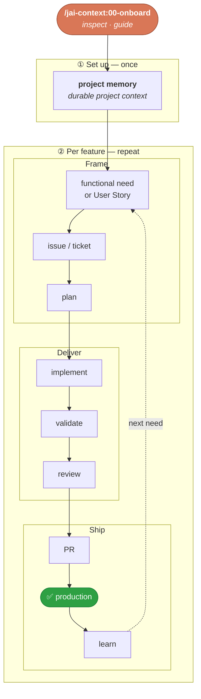

<div align="center">


# Jorgo AI Framework

## Personal SDLC toolkit for AI-assisted software development.

> Personal fork of [ai-driven-dev/framework](https://github.com/ai-driven-dev/framework) (MIT), adapted and maintained by [Jorgo69](https://github.com/Jorgo69).

Unify **engineering workflows** around **standardized skills** and **shared best practices**, across modern stacks and **legacy systems**, while reducing **technical debt**.

🧱 **IDE agnostic** · 🏗️ **Legacy systems** · 🌱 **Token-optimized**

<p>
  <!--counts:start--><kbd>8 plugins</kbd> · <kbd>50 skills</kbd> · <kbd>2 agents</kbd><!--counts:end-->
</p>

[](https://opensource.org/)
[](LICENSE)
[](https://github.com/Jorgo69/jorgo-ai-framework/releases)
[](https://github.com/Jorgo69/jorgo-ai-framework/actions/workflows/ci.yml)

</div>

---

The **Jorgo AI Framework** installs a working SDLC (Software Development Life Cycle) into your AI coding tool — **skills, agents, commands, rules** — that turns a rough idea into a reviewed, shipped pull request:

```text
/jai-orchestrator:01-sdlc "add rate limiting to the /login endpoint"
→ frame when needed → plan → implement → validate → review → challenge → ship
```

Why not just write your own commands? → [FAQ](docs/FAQ.md#-why-aidd-instead-of-your-own-skills).

## ✅ Prerequisites

- **An AI coding tool** — Claude Code (native), or Cursor / Copilot / Codex / OpenCode (see [Compatibility](#-compatibility)).
- **[Node](https://nodejs.org) 22 or later** on your `PATH`, only for the plugin that ships hooks ([what they do](docs/ARCHITECTURE.md#-bundled-hooks)); the workflows themselves are markdown and need nothing.

## 🔌 Compatibility

| Tool | Status | Release dist |
| --- | --- | --- |
| **Claude Code** | ✅ Native · recommended | Marketplace |
| **Cursor** | ✅ Supported | Marketplace · Flat |
| **GitHub Copilot** | ✅ Supported | Marketplace · Flat |
| **Codex** | ✅ Supported | Marketplace · Flat |
| **OpenCode** | ✅ Supported | Flat |
| **Gemini · Mistral** | 🚧 In progress | — |

<sub>**Marketplace** = installed and updated through your tool's plugin manager. **Flat** = files copied directly into your project, no plugin manager involved. Install steps per tool → [Other tools](#other-tools).</sub>

## 📦 Install

### Claude Code

Installs the 6 stable plugins (`jai-ui` is 🚧 alpha and `jai-telemetry` 🧪 beta, install separately — see [Plugins](#-plugins)).

**In the session** (slash commands)

```text
/plugin marketplace add Jorgo69/jorgo-ai-framework
/plugin install jai-context@jorgo-ai-framework
/plugin install jai-refine@jorgo-ai-framework
/plugin install jai-dev@jorgo-ai-framework
/plugin install jai-vcs@jorgo-ai-framework
/plugin install jai-pm@jorgo-ai-framework
/plugin install jai-orchestrator@jorgo-ai-framework
```


<details>
<summary><strong>Command line</strong> (same, prefixed with `claude`)</summary>

```bash
claude plugin marketplace add Jorgo69/jorgo-ai-framework
claude plugin install jai-context@jorgo-ai-framework
claude plugin install jai-refine@jorgo-ai-framework
claude plugin install jai-dev@jorgo-ai-framework
claude plugin install jai-vcs@jorgo-ai-framework
claude plugin install jai-pm@jorgo-ai-framework
claude plugin install jai-orchestrator@jorgo-ai-framework
```
</details

<br/>Update anytime: `/plugin marketplace update jorgo-ai-framework`.

### Other tools

Same plugin names as Claude Code.

Download your tool's bundle from the [latest release](https://github.com/Jorgo69/jorgo-ai-framework/releases/latest), then follow its steps:

> [!NOTE]
> Installing the framework host-wide for several tools can make the same command appear more than once in a tool's list. This happens when one tool reads another tool's settings, and is harmless.

<details>
<summary><strong>Cursor</strong></summary>

**Marketplace**

1. Unzip the `cursor-marketplace` archive.
2. Copy the plugins (Cursor reloads them automatically):

```bash
cp -r plugins/jai-* ~/.cursor/plugins/local/
```

**Flat**

1. Unzip the `cursor-flat` archive into your project root → `.cursor/`.

_All plans; team marketplaces need Teams/Enterprise. Also reads Claude format (`.claude/skills/`)._

Disable **Include Third-Party Plugins, Skills, and Other Configs** under **Settings → Rules, Skills, Subagents** to hide the duplicate commands.

[Docs](https://cursor.com/docs/plugins)

</details>

<details>
<summary><strong>GitHub Copilot</strong></summary>

**Marketplace**

1. Unzip the `copilot-marketplace` archive.
2. Run:

```bash
copilot plugin marketplace add ./jorgo-ai-framework-copilot-marketplace-<version>
copilot plugin install jai-context@jorgo-ai-framework   # per plugin
```

**Flat**

1. Unzip the `copilot-flat` archive into your project root → `.github/`.

_Also reads Claude format (`.claude/skills/`, `.claude/agents/`)._

[Docs](https://docs.github.com/en/copilot/how-tos/copilot-cli/customize-copilot/plugins-finding-installing)

</details>

<details>
<summary><strong>Codex</strong></summary>

**Marketplace**

1. Unzip the `codex-marketplace` archive.
2. Run:

```bash
codex plugin marketplace add ./jorgo-ai-framework-codex-marketplace-<version>
codex plugin add jai-context@jorgo-ai-framework   # per plugin
```

**Flat**

1. Unzip the `codex-flat` archive into your project root → `.codex/`.

[Docs](https://developers.openai.com/codex/plugins/build)

</details>

<details>
<summary><strong>OpenCode</strong> — Flat only</summary>

1. Unzip the `opencode-flat` archive into your project root → `.opencode/`.

[Docs](https://opencode.ai/docs/config/)

</details>

## 🚀 Quick start

Three ways in — pick one:

| Start with | Command | When |
| --- | --- | --- |
| 🧭 **Guided onboarding** | `/jai-context:00-onboard` | First time, or unsure what to run — it inspects the project and routes you. |
| 🧠 **Project memory** | `/jai-context:02-project-memory` | Build the project memory bank by hand. |
| ⚙️ **Feature flow** | `/jai-orchestrator:01-sdlc` | Autonomously ship a feature end to end (frame → deliver → check → PR). |

The full loop, and how onboarding sets it up:



Start with a functional need or User Story, then track it as an issue or ticket
before planning. Shipping follows the project's own delivery process. Capture a
learning only when it is durable enough to improve the next feature.

> 🍳 **More flows** → bundled recipes: [start a project](plugins/jai-context/skills/12-cook/assets/recipes/start-a-project.md), [ship a feature](plugins/jai-context/skills/12-cook/assets/recipes/ship-a-feature.md), and more.

## 🧩 Plugins

Eight plugins covering the whole SDLC — **install all of them**; they work together. (`jai-ui` is 🚧 **alpha** and `jai-telemetry` 🧪 **beta** — both off the curated path.)

<table>
<tr>
<td width="33%" valign="top">

### 🧭 [jai-context](plugins/jai-context/README.md)

`13 skills` · stable

Project init, memory bank, context-artifact generation, diagrams, learning, exploration.

</td>
<td width="33%" valign="top">

### ⚙️ [jai-dev](plugins/jai-dev/README.md)

`11 skills` · stable

Code transformation: plan, implement, assert, audit, review, test, refactor, debug. Standalone Browser QA records short web evidence.

</td>
<td width="33%" valign="top">

### 🌿 [jai-vcs](plugins/jai-vcs/README.md)

`5 skills` · stable

Repo init, commits, pull / merge requests, release tags, issues.

</td>
</tr>
<tr>
<td width="33%" valign="top">

### 📋 [jai-pm](plugins/jai-pm/README.md)

`10 skills` · stable

Three Amigos refinement, Product Briefs, Epics, User Stories, Tasks, Spikes, Defects, PRD, and specs.

</td>
<td width="33%" valign="top">

### 🪞 [jai-refine](plugins/jai-refine/README.md)

`4 skills` · stable

Brainstorm, challenge, shadow-areas, fact-check.

</td>
<td width="33%" valign="top">

### 🎼 [jai-orchestrator](plugins/jai-orchestrator/README.md)

`3 skills` · stable

Synchronous feature flow, async issue-to-PR automation, and product backlog.

</td>
</tr>
<tr>
<td width="33%" valign="top">

### 🎨 [jai-ui](plugins/jai-ui/README.md) 🚧

`1 skill` · **alpha**

UI / UX design — smoke-test only, not ready for use.

</td>
<td width="33%" valign="top">

### 📈 [jai-telemetry](plugins/jai-telemetry/README.md) 🧪

`3 skills` · **beta**

Answers what a piece of work cost — tokens, models, and which skill spent them. The switch is git-tracked, so it applies to everyone who clones; opt out per person with `AIDD_TELEMETRY=0`. Nothing leaves your machine.

</td>
<td width="33%" valign="top"></td>
</tr>
</table>

Full catalog → [`CATALOG.md`](docs/CATALOG.md).

## 📚 Learn more

| | |
| --- | --- |
| 🍳 **Recipes** | Bundled how-to sheets: [start a project](plugins/jai-context/skills/12-cook/assets/recipes/start-a-project.md), [ship a feature](plugins/jai-context/skills/12-cook/assets/recipes/ship-a-feature.md), [MCP installations](plugins/jai-context/skills/12-cook/assets/recipes/mcp-installation.md), [token optimization](plugins/jai-context/skills/12-cook/assets/recipes/token-optimization.md). Project recipes created by cook live in `aidd_docs/recipes/`. |
| 🏛️ **[Architecture](docs/ARCHITECTURE.md)** | How the framework composes: plugins, skills, hooks, agents. |
| 🧩 **[Create a plugin](docs/CREATE_PLUGIN.md)** | Build and publish your own. |
| 🛒 **[Marketplace](docs/MARKETPLACE.md)** | Install scopes, versioning, LLM tiers. |
| ❓ **[FAQ & Troubleshooting](docs/FAQ.md)** · **[Glossary](docs/GLOSSARY.md)** | Common questions, fixes, and terms. |

## 🔒 Trust and safety

Plugins act with **your permissions**, and some run **Node hooks automatically** at session events ([the list](docs/ARCHITECTURE.md#-bundled-hooks)).

Before installing any plugin, skim its `README`, `hooks/`, and `.mcp.json`. Found a vulnerability? Report it privately → [`SECURITY.md`](SECURITY.md).

## 🧑‍💻 Credit: the AI-Driven Dev community

This project is a personal fork of the framework built by the [AI-Driven Dev](https://www.ai-driven-dev.fr/) community: 3 years of R&D, 500+ developers trained in English 🇬🇧 and French 🇫🇷, shipping production software with 100% AI-generated code. All credit for the original design goes to them — this fork adapts it to a personal workflow.

- **[Join the Discord 🇫🇷](https://discord.gg/EWySJSpjWs)** — public [roadmap](ROADMAP.md) decisions every Thursday morning.
- **Want to train your team?** [See the programme](https://www.ai-driven-dev.fr/entreprise).
- **AI is important to you?** [Join the ecosystem](https://www.ai-driven-dev.fr/ecosysteme).

## 🤝 Contributing

Free and open-source (MIT). If it saves you time, [a ⭐](https://github.com/Jorgo69/jorgo-ai-framework/stargazers) helps others find it.

- **Idea or bug?** [Open an issue](https://github.com/Jorgo69/jorgo-ai-framework/issues) or [start a discussion](https://github.com/Jorgo69/jorgo-ai-framework/discussions).
- **Contribute code** → [`CONTRIBUTING.md`](CONTRIBUTING.md).

[](https://github.com/Jorgo69/jorgo-ai-framework/graphs/contributors)

---

<div align="center">

<a href="https://github.com/Jorgo69/jorgo-ai-framework/stargazers"></a>

Maintained by [Jorgo69](https://github.com/Jorgo69) · Forked from [ai-driven-dev/framework](https://github.com/ai-driven-dev)

</div>
