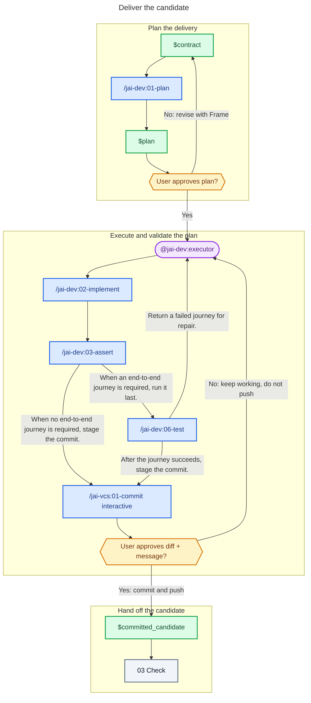

# 02 - Deliver

## Behavior

Present the plan to the user and wait for explicit approval before handing it to an executor. Once approved, give the executor the plan. The executor implements it and calls the validation skills, which own their checks and repair loops. Include architecture conformance whenever the project documents architecture. Run a required end-to-end journey after every other validation.

Call the commit skill in `interactive` mode, never `auto`: it stages the change, drafts the conventional message, and pauses for the user's explicit approval before committing or pushing. Only send the approved, committed candidate to Check.

